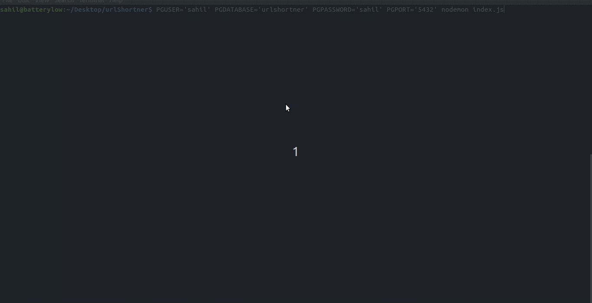

# URL Shortner

A simple URL Shortner built using Node.js and Express.js as backend, an HTML frontend, and postgreSQL as database.

## Introduction

It's a simple application that takes a URL as input and outputs a substring of its hashed version (of the URL) as a shortened URL.

The following endpoints are available

    GET /<short_URL>  - Redirects user to the original URL, if it exists in the database else throws a 404 error if there isn't any record.

    DELETE /<short_URL> - Deletes an existing short URL from the database if it exists, else throws a 404 error if there isn't any record.

    POST /generate-short-url - Generates the hashed version of the long url. The POST parameters should be {url: <long_URL>}. Returns the short url as json response {short-url: <hashed_substring>} 

    GET /list   - Retieves the list of all the records in the database. A record consists of the original URL, its shortened version and its hitrate, i.e, number of times the link has been clicked.
 
The frontend has allows you to see current existing records, enter a new record and see the hitrates of the URLs. Also, you can delete any record directly from the frontend.

It also has a rate limiter, which allows a maximum of 20 requests per second overall and throttles them if the number exceeds.

See the following GIF that I made to see how it looks in action and how the database gets changed everytime we change something:



---
## Requirements

* Node.js
* Express.js
* postgreSQL 

### Node
- #### Node installation on Ubuntu

  You can install nodejs and npm easily with apt install, just run the following commands.

      $ sudo apt install nodejs
      $ sudo apt install npm

    If the installation was successful, you should be able to run the following command.

    ```
    $ node --version
    v12.4.0
    
    $ npm --version
    6.9.0
    ```


    If you need to update `npm`, you can make it using `npm`!  After running the following command, just open again the command line and be happy.

    `$ npm install npm -g`

### postgreSQL
Install postgreSQL on your machine.

-   `sudo apt update`
-   `sudo apt install postgresql postgresql-contrib`

After executing the above two commands, create a new user for yourself by entering:

-   `sudo -u postgres createuser --interactive`

It will ask you to enter your *USERNAME* (for the most part it should be your machine's username) and if it needs to be superuser role. Enter your username and press y for making it a superuser.

-   Create a database by typing `sudo -u USERNAME createdb DATABASENAME` to create a database.

-   You may also need to set password for your new user.

        $ psql
        $ ALTER USER USERNAME WITH PASSWORD 'myPassword';
        $ \q

Note that USERNAME in the above commands is what you put your username as.

---

## Install

    $ git clone https://github.com/me-ydv-5/urlShortner
    $ cd urlShortner
    $ git checkout master-1
    $ psql DATABASENAME < urlshortner
    $ npm install

The last command imports the database from the dump.


## Running the project

Run the project with  the following command:

    PGUSER='USERNAME' PGDATABASE='DATABASENAME' PGPASSWORD='USERPASSWORD' PGPORT='5432' nodemon index.js

Where USERNAME is your username, DATABASENAME is the name of database you created in the above commands, USERPASSWORD is your account's password in postgres that you created.

Go to `localhost:3000` and try out the app.

If everthing goes well, you should be able to see the app frontend as well as send HTTP requests directly to the backend.

**NOTE: If you have problems setting up the postgresql, see [this](https://www.digitalocean.com/community/tutorials/how-to-install-and-use-postgresql-on-ubuntu-18-04)**
